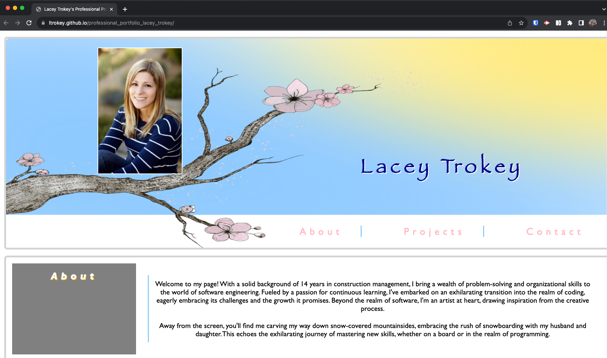
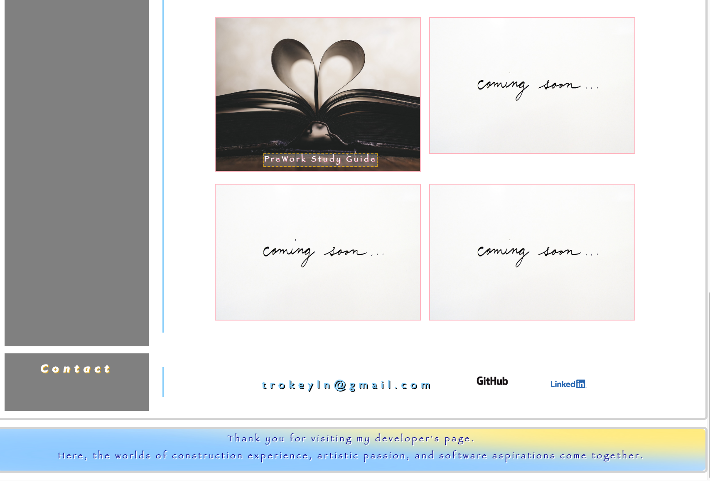
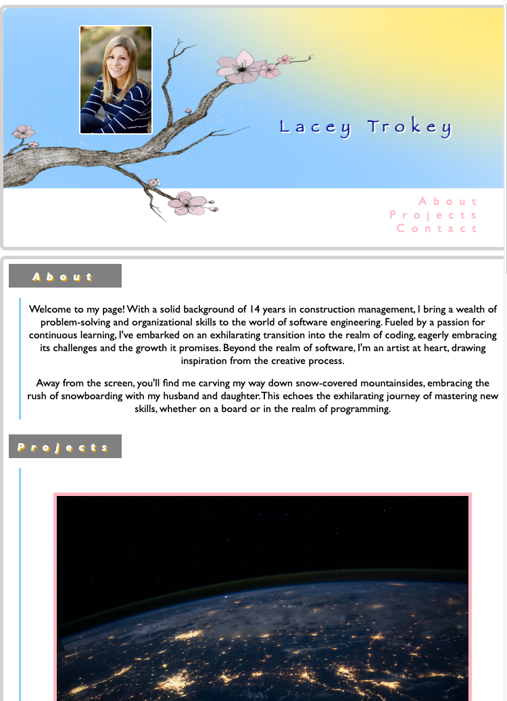
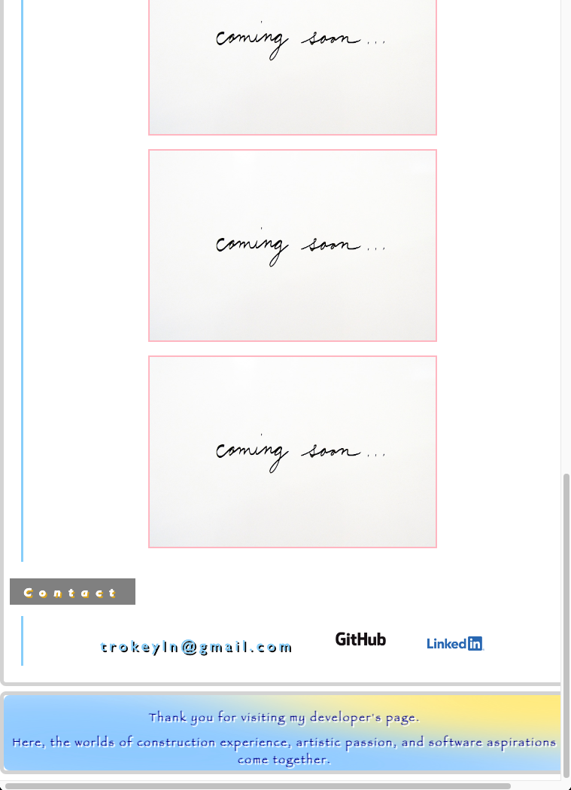

# Professional Portfolio - Lacey Trokey>

[Link to live deploy](https://ltrokey.github.io/professional_portfolio_lacey_trokey/)

## Description

In my professional portfolio, I've skillfully merged my background in art and construction with my developing expertise as I showcase my HTML and CSS skills through a theme centered around one of my art pieces. Notably, I've mastered responsive design to ensure seamless cross-device experiences and refined project structuring for better maintainability. 

Overcoming challenges, the most prominent being integrating a background image extending onto the navigation bar giving the illusion of branches emerging and also adapting the responsive layout from large to small screens. These challenges have added depth to my problem-solving abilities. This portfolio reflects my growth as a developer, embodying the fusion of creativity and technical prowess.

## Usage

### Desktop Screen Viewing

 

### Mobile Screen Viewing (Max-Width: 768px)

## License

MIT License

Copyright (c) 2023 ltrokey

Permission is hereby granted, free of charge, to any person obtaining a copy
of this software and associated documentation files (the "Software"), to deal
in the Software without restriction, including without limitation the rights
to use, copy, modify, merge, publish, distribute, sublicense, and/or sell
copies of the Software, and to permit persons to whom the Software is
furnished to do so, subject to the following conditions:

The above copyright notice and this permission notice shall be included in all
copies or substantial portions of the Software.

THE SOFTWARE IS PROVIDED "AS IS", WITHOUT WARRANTY OF ANY KIND, EXPRESS OR
IMPLIED, INCLUDING BUT NOT LIMITED TO THE WARRANTIES OF MERCHANTABILITY,
FITNESS FOR A PARTICULAR PURPOSE AND NONINFRINGEMENT. IN NO EVENT SHALL THE
AUTHORS OR COPYRIGHT HOLDERS BE LIABLE FOR ANY CLAIM, DAMAGES OR OTHER
LIABILITY, WHETHER IN AN ACTION OF CONTRACT, TORT OR OTHERWISE, ARISING FROM,
OUT OF OR IN CONNECTION WITH THE SOFTWARE OR THE USE OR OTHER DEALINGS IN THE
SOFTWARE.

